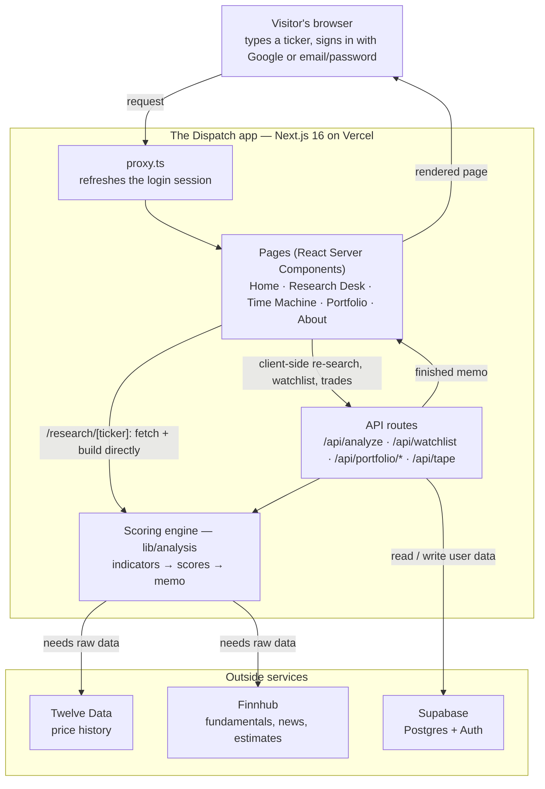

# Architecture

_A plain-language explanation of how The Dispatch works — no engineering background required._

## What this app does

You type a stock ticker (like `AAPL`). A few seconds later, you get back a full written analysis: how the business is doing financially, how the stock has been trading, what analysts and the news are saying, what could go wrong, and an overall rating — built fresh from real, live data every time you ask.

## The three pieces working together

**1. The website itself** — what you see and click on. It's hosted by a company called Vercel, which keeps the site running and reachable at `dispatchresearch.com` (think of Vercel like a landlord for the site).

**2. The "analyst"** — the part of the app that does the actual thinking. It takes raw numbers and turns them into the scores, the write-up, and the rating you read. This never runs in your browser — it runs privately behind the scenes, so nobody visiting the site can see or tamper with how it works.

**3. Outside data sources** — the app doesn't know anything about stocks on its own. It buys access to real data from two outside companies:
- **Twelve Data** — supplies stock prices, today's and years of history.
- **Finnhub** — supplies company financials, analyst opinions, and news.

There's also a fourth piece, **Supabase**, which is where the app keeps track of things tied to *you* specifically — your login, your watchlist, your paper-trading account. Think of it like a filing cabinet where every user's folder is locked, so nobody else can open yours, and you can't open theirs.

## What happens when you search a ticker

1. You type a ticker and hit search.
2. The app quietly checks whether you're signed in, so it can keep you logged in without you having to re-enter anything.
3. The app asks Twelve Data for the stock's price history and asks Finnhub for the company's financials and recent news — both at once, so it's fast.
4. Once that raw information comes back, the "analyst" turns it into a score out of 10 for the fundamentals, the technicals (price trends), and the sentiment (news/analyst mood) — then blends those into one overall rating.
5. That finished write-up is what shows up on the page.
6. If you're signed in, that ticker is added to your watchlist automatically, and if you place a paper trade, it's saved to your account.

## The Time Machine

You can pick any date from the last few years and see the memo as if it were written *that day* — the price trends and news mood get recalculated using only the information that existed back then. Company financials are hidden for old dates instead of showing stale numbers, since there isn't an accurate record of what they looked like at that exact moment. You can then flip to today's version and compare the two side by side.

## Keeping things safe

- **Nobody can see the "secret keys."** The app pays Twelve Data and Finnhub for access using private passwords that live only on the server — never sent to your browser, never visible to visitors.
- **Your data is yours alone.** Your watchlist and paper-trading account are locked to your account specifically; there's no way for the app to accidentally mix up your data with someone else's.
- **Trade prices can't be faked.** When you buy or sell in paper trading, the app looks up the real price itself rather than trusting whatever a browser sends it — so there's no way to cheat the system by tampering with a request.

---

<strong>Technical appendix</strong> (for engineers, or a future AI working on this code)

### The request lifecycle, step by step

1. A visitor opens the site and searches a ticker (e.g. `AAPL`). The browser's request first passes through `proxy.ts`, which keeps the Supabase login session fresh.
2. A page (server-rendered React) handles the view. Visiting `/research/[ticker]` directly (a shared link, a search result) calls the **scoring engine** server-side, in-process — no HTTP hop. Everything else that needs a memo (searching a new ticker without navigating, watchlist chips, the Time Machine's "compare to today") goes through the client and hits an internal **API route** instead, since it's the browser driving it after the page has already loaded. Both paths share the same fetch/cache/build logic (`lib/analysis/loadReport.ts`), so they can't drift apart.
3. Either way, building a memo means calling the **scoring engine** in `lib/analysis`, which needs raw market data.
4. The engine pulls that data server-side from **Twelve Data** (prices) and **Finnhub** (fundamentals, news, analyst estimates), using API keys held privately on the server — never exposed to the visitor. Provider responses are cached (`lib/providers.ts`, via `unstable_cache`) so a repeat lookup of the same ticker doesn't re-spend API credits.
5. The engine computes indicators, scores each dimension 1–10, and assembles the memo text.
6. The finished memo is rendered. If the visitor is signed in, their watchlist and paper-trading data are read from and written to **Supabase**.

### Tech stack

| Layer | Technology | Role |
|---|---|---|
| Framework | Next.js 16 (App Router) + React 19 | Serves both the pages and the API routes from one codebase |
| Language | TypeScript | Type-safe application code |
| Hosting | Vercel | Deploys and hosts the app; custom domain `dispatchresearch.com` |
| Database & auth | Supabase (Postgres + Auth) | User data storage; Google OAuth and email/password sign-in |
| Market data | Twelve Data, Finnhub | External price, fundamentals, news and estimate feeds |

### Where things live

| Path | What it holds |
|---|---|
| `app/` | Pages and routes. `page.tsx` (home), `about/`, `research/` (Research Desk + Time Machine, plus server-rendered `research/[ticker]/` memo pages), `portfolio/`, `auth/callback/` |
| `app/api/` | Back-office endpoints: `analyze/[ticker]`, `watchlist`, `tape` (homepage ticker strip), `portfolio/account`, `portfolio/trade`, `portfolio/equity-curve` |
| `lib/analysis/` | The scoring engine: `indicators.ts` (RSI, MACD, moving averages, volatility), `scoring.ts` (1–10 scores), `report.ts` (assembles the memo), `loadReport.ts` (shared fetch/cache/build used by both the API route and the SSR ticker pages), `historical.ts` (Time Machine slicing) |
| `lib/providers.ts` | Server-side wrappers for the Twelve Data and Finnhub APIs, with per-symbol response caching |
| `lib/db.ts`, `lib/supabase/` | Request-scoped Supabase client used by the API routes |
| `lib/portfolio.ts` | Paper-trading logic (positions, cash, equity snapshots) |
| `components/` | React UI: `research/`, `portfolio/`, `layout/`, `auth/` |
| `proxy.ts` | Session middleware (renamed from `middleware` in Next.js 16) |

### Data & security notes

- **Secrets stay on the server.** Provider API keys live in server environment variables. The browser never sees them; earlier versions of the app asked each visitor to paste their own key, and this design replaced that.
- **Per-user isolation.** User data (`watchlist`, `paper_account`, `paper_position`, `equity_snapshot`) is protected by Postgres **Row Level Security**, so every query is automatically scoped to the signed-in user — one user can never read another's data.
- **Prices are never trusted from the client.** Trades send only `{ ticker, side, shares }`; the executing price is looked up server-side, so a tampered request can't set its own price.

