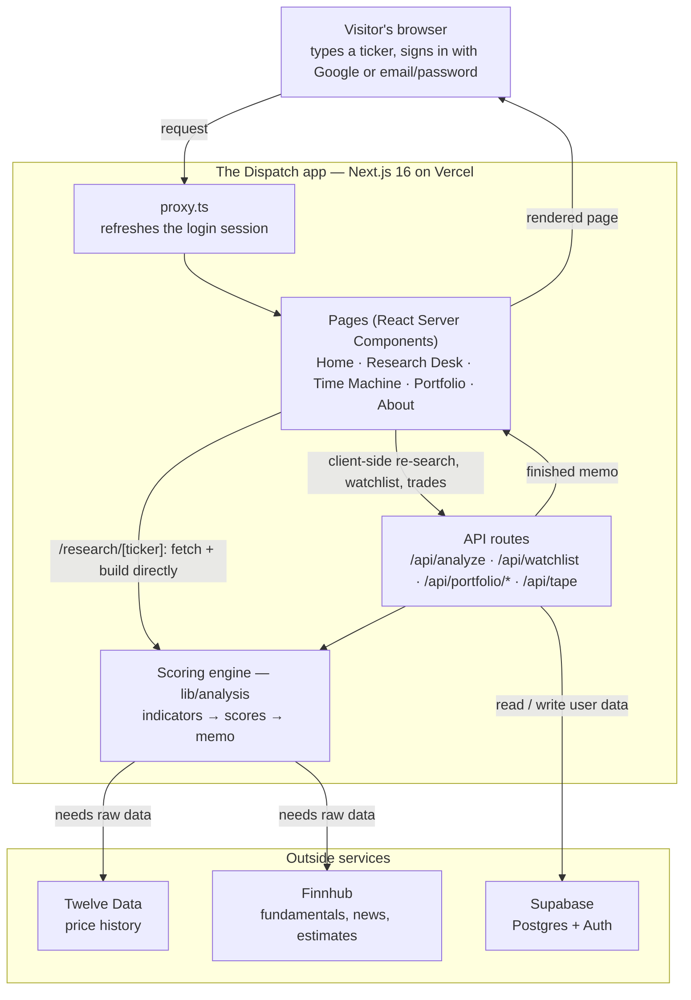

# Architecture

_The Dispatch (`dispatch-web`) — an equity-research app. Type a U.S. stock ticker, get back a structured memo in a few seconds: scorecard, fundamentals, technicals, sentiment, risks, catalysts._

This document is the map of how the pieces fit together. It follows a single request from the visitor's browser all the way to the finished memo and back.

## The big picture

## The request lifecycle, step by step

1. A visitor opens the site and searches a ticker (e.g. `AAPL`). The browser's request first passes through `proxy.ts`, which keeps the Supabase login session fresh.
2. A page (server-rendered React) handles the view. Visiting `/research/[ticker]` directly (a shared link, a search result) calls the **scoring engine** server-side, in-process — no HTTP hop. Everything else that needs a memo (searching a new ticker without navigating, watchlist chips, the Time Machine's "compare to today") goes through the client and hits an internal **API route** instead, since it's the browser driving it after the page has already loaded. Both paths share the same fetch/cache/build logic (`lib/analysis/loadReport.ts`), so they can't drift apart.
3. Either way, building a memo means calling the **scoring engine** in `lib/analysis`, which needs raw market data.
4. The engine pulls that data server-side from **Twelve Data** (prices) and **Finnhub** (fundamentals, news, analyst estimates), using API keys held privately on the server — never exposed to the visitor.
5. The engine computes indicators, scores each dimension 1–10, and assembles the memo text.
6. The finished memo is rendered. If the visitor is signed in, their watchlist and paper-trading data are read from and written to **Supabase**.

## Tech stack

| Layer | Technology | Role |
|---|---|---|
| Framework | Next.js 16 (App Router) + React 19 | Serves both the pages and the API routes from one codebase |
| Language | TypeScript | Type-safe application code |
| Hosting | Vercel | Deploys and hosts the app; custom domain `dispatchresearch.com` |
| Database & auth | Supabase (Postgres + Auth) | User data storage; Google OAuth and email/password sign-in |
| Market data | Twelve Data, Finnhub | External price, fundamentals, news and estimate feeds |

## Where things live

| Path | What it holds |
|---|---|
| `app/` | Pages and routes. `page.tsx` (home), `about/`, `research/` (Research Desk + Time Machine, plus server-rendered `research/[ticker]/` memo pages), `portfolio/`, `auth/callback/` |
| `app/api/` | Back-office endpoints: `analyze/[ticker]`, `watchlist`, `tape` (homepage ticker strip), `portfolio/account`, `portfolio/trade`, `portfolio/equity-curve` |
| `lib/analysis/` | The scoring engine: `indicators.ts` (RSI, MACD, moving averages, volatility), `scoring.ts` (1–10 scores), `report.ts` (assembles the memo), `loadReport.ts` (shared fetch/cache/build used by both the API route and the SSR ticker pages), `historical.ts` (Time Machine slicing) |
| `lib/providers.ts` | Server-side wrappers for the Twelve Data and Finnhub APIs |
| `lib/db.ts`, `lib/supabase/` | Request-scoped Supabase client used by the API routes |
| `lib/portfolio.ts` | Paper-trading logic (positions, cash, equity snapshots) |
| `components/` | React UI: `research/`, `portfolio/`, `layout/`, `auth/` |
| `proxy.ts` | Session middleware (renamed from `middleware` in Next.js 16) |

## Data & security notes

- **Secrets stay on the server.** Provider API keys live in server environment variables. The browser never sees them; earlier versions of the app asked each visitor to paste their own key, and this design replaced that.
- **Per-user isolation.** User data (`watchlist`, `paper_account`, `paper_position`, `equity_snapshot`) is protected by Postgres **Row Level Security**, so every query is automatically scoped to the signed-in user — one user can never read another's data.
- **Prices are never trusted from the client.** Trades send only `{ ticker, side, shares }`; the executing price is looked up server-side, so a tampered request can't set its own price.

## The Time Machine

The Research Desk can rebuild a memo "as of" any past date within roughly the last three years: technicals and sentiment are recomputed from that day's data under today's scoring rules, while fundamentals are held back rather than shown stale. This powers the side-by-side "then vs. now" comparison view.
